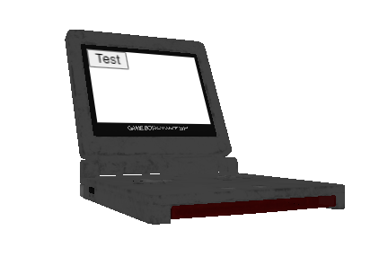

Permite seleccionar una cara o mesh del modelo 3D para planchar un plano con un elemento html (o DOM).

No es la version final

Pero permite resultados como este: 

El modelo se puede rotar y el div irá con el en la pantalla.
El boton es funcionar y se puede añadir cualquier html en lugar de este test
